# Skills Assessment: Network Foundations

## Chapter 1: Pwnbox Workspace & Interface Enumeration

For this assessment, we utilize the HTB Academy Pwnbox, a browser-based Parrot OS Linux environment that serves as our primary attack workstation. 

Our initial step involves investigating the available network interfaces on the local machine:

`ifconfig -a`

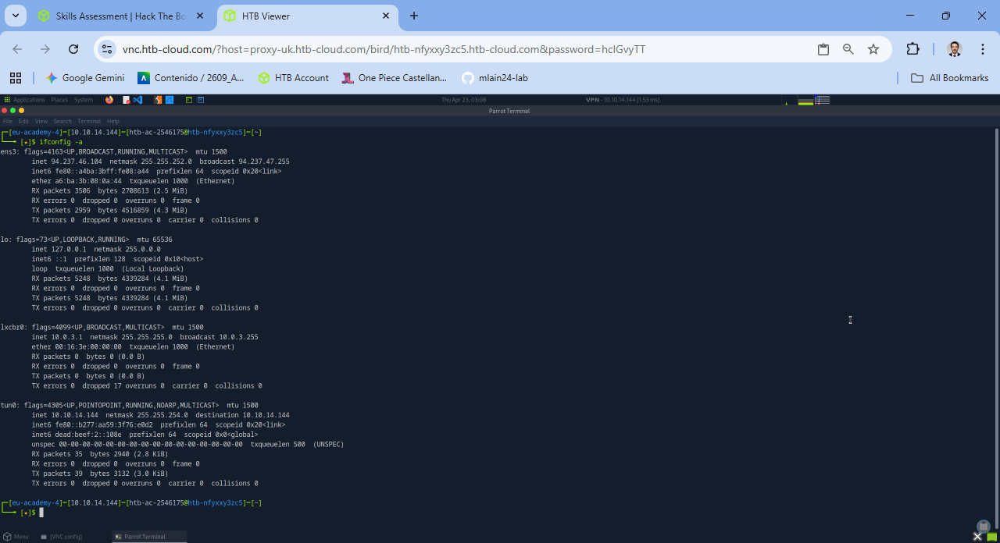

*Note: The `ifconfig` utility configures and displays the status of network interfaces. The `-a` flag ensures all interfaces are listed, including those currently disabled.*

The output reveals the `lo` (loopback) interface mapped to `127.0.0.1`, which is the standard IP used for local host communication. 

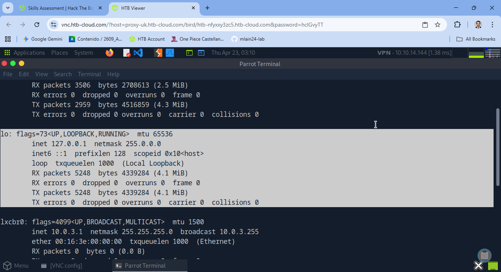

To verify how the system utilizes this address, we inspect active connections:

`netstat -tulnp4`

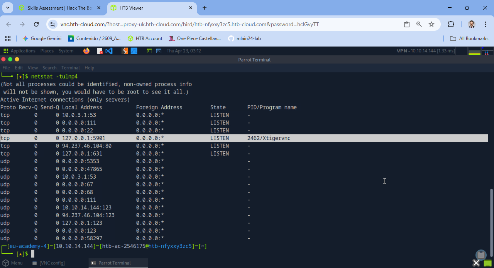

*Note: `netstat` provides comprehensive network connection and routing statistics.*

Running the command without the `-n` flag resolves IP addresses and ports into hostnames and service names:

`netstat -tulp4`

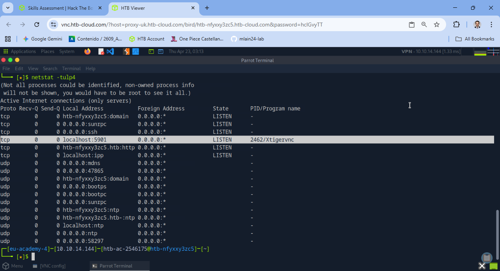

This confirms that the loopback IP resolves to `localhost`, while the `ens3` interface resolves to the Pwnbox hostname. Furthermore, any service bound to `0.0.0.0` is actively listening across all available interfaces. 

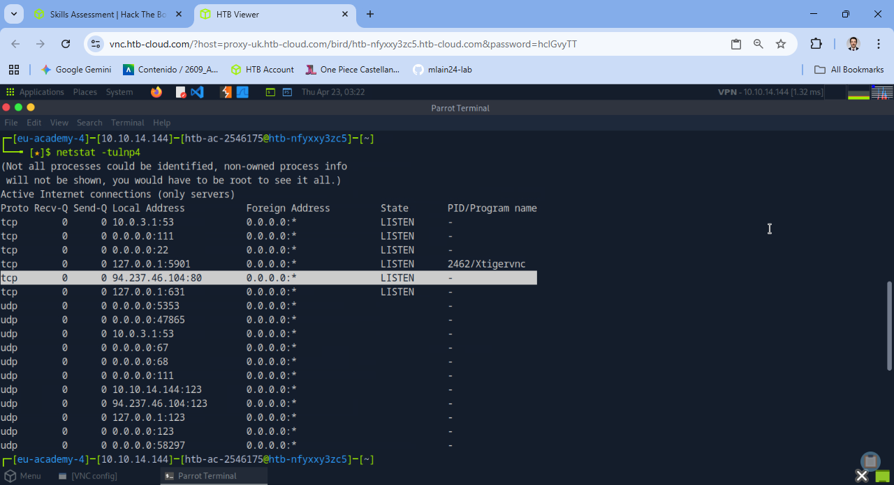

Based on this enumeration, we can determine that the system is listening on port 80, and the IP bound to the `ens3` interface acts as the public IP for the Pwnbox.

---

## Chapter 2: VPN Connectivity & Target Discovery

Connecting to the private HTB Academy lab network requires a VPN tunnel from our Kali Linux environment.

Following the interface enumeration in Chapter 1, we identified `lo` (internal traffic) and `ens3` (public traffic). The VPN connection introduces a third interface: `tun0`. We can verify that traffic destined for the target network routes through this tunnel:

`ip route get 10.129.233.197`

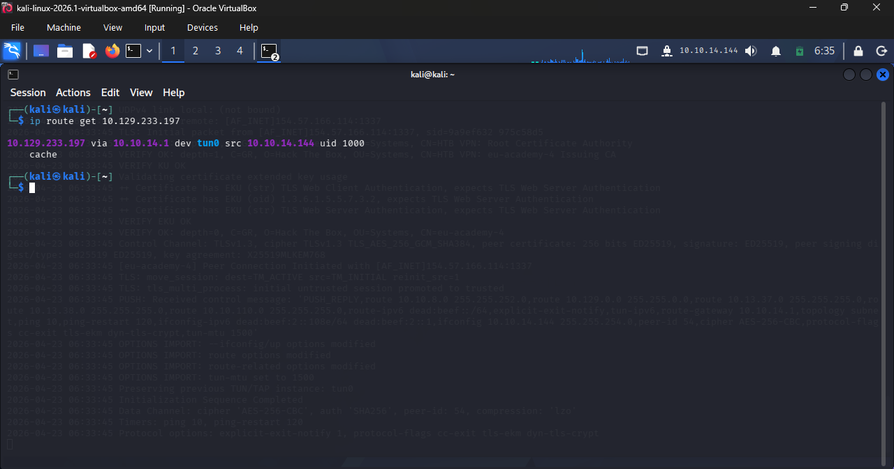

This confirms that outbound traffic to the target is successfully routed via the `tun0` VPN interface. 

To validate end-to-end connectivity, we execute a standard ICMP echo request:

`ping -c 4 10.129.233.197`

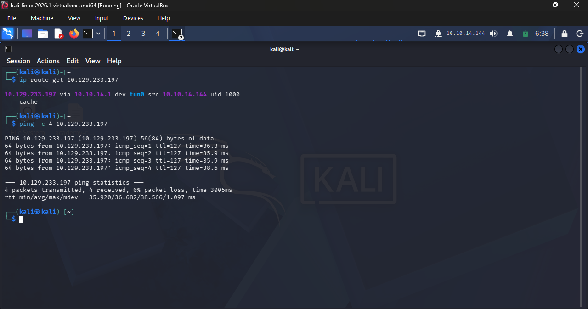

> **Networking Concepts Explained:**
> * **TTL (Time To Live):** >     * *EN:* A value in an IP packet that prevents it from circulating indefinitely in the network. Each router hop decreases this value by 1; if it hits 0, the packet is dropped. It also helps fingerprint the target OS (e.g., Windows typically defaults to 128, Linux to 64).
>     * *ES:* Un valor en el paquete IP que evita bucles infinitos en la red. Cada router por el que pasa resta 1; si llega a 0, el paquete se descarta. También sirve para deducir el sistema operativo del objetivo (Windows suele ser 128, Linux 64).
> * **Time (Latency):** >     * *EN:* The round-trip time (RTT) measured in milliseconds (ms) that it takes for the ICMP packet to reach the target and return to the host.
>     * *ES:* El tiempo de ida y vuelta (latencia) medido en milisegundos (ms) que tarda el paquete en llegar al destino y volver a nuestro equipo.

With connectivity verified, the next phase is service enumeration across TCP/UDP ports:

`nmap 10.129.233.197`

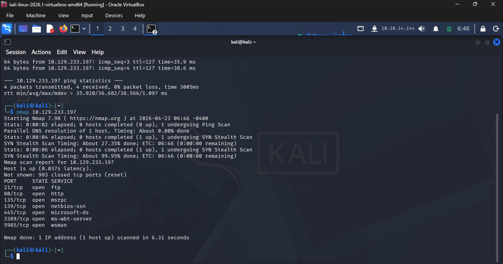

The scan results indicate a standard Windows environment footprint. We observe open ports 135, 139, and 445, which are characteristic of Windows RPC and SMB services. Additionally, port 3389 is open, indicating the presence of the Remote Desktop Protocol (RDP). Finally, port 5357 is active, which is tied to the Web Services for Devices (WSD) API, a Microsoft protocol utilized for network device discovery.

---

## Chapter 3: Deep Dive into FTP and HTTP Protocols

This phase narrows the focus to file transfer and web services. We execute a targeted Nmap scan against ports 21 (FTP) and 80 (HTTP) to extract service versions and run default enumeration scripts:

`nmap -p21,80 -sC -sV 10.129.233.197`

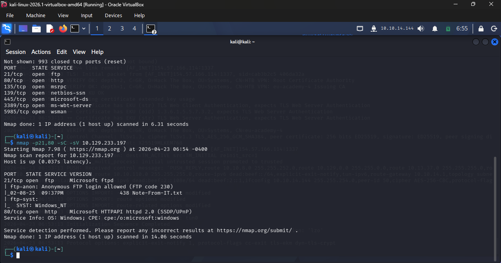

The Nmap output confirms that the FTP server allows anonymous access, meaning we can authenticate using `anonymous` as the username without a valid password. 

Conversely, the HTTP service on port 80 yields minimal data. While standard layer-4 scans only confirm port status, our layer-7 `-sV` and `-sC` flags typically fingerprint web servers (like IIS or Nginx). The lack of a detailed response strongly suggests the presence of application-level filtering, likely blocking standard Nmap HTTP requests.

### Raw FTP Interaction via Netcat

To gain a granular understanding of the protocol syntax, we bypass standard FTP client software and interact directly with the service using `netcat`. By establishing a raw TCP connection, we manually transmit commands, offering deeper insight into how FTP processes authentication and data flow.

`nc 10.129.233.197 21`

Upon connection, the server returns a `220 Microsoft FTP Service` banner. We then proceed to authenticate manually:

    USER anonymous[Ctrl+V][Enter][Enter]
    PASS anything[Ctrl+V][Enter][Enter]
    PASV[Ctrl+V][Enter][Enter]

*Protocol Note:* Standard terminal keystrokes only send a newline character (`\n`). However, the FTP protocol strictly requires a Carriage Return and Line Feed sequence (`\r\n`) to parse commands correctly. Using `[Ctrl + V]` before pressing Enter forces the terminal to transmit the required formatting.

#### Calculating the Passive Mode Data Port

FTP architecture relies on two distinct channels:
* **Control Channel (Port 21):** Handles authentication and command execution.
* **Data Channel (Dynamic Port):** Handles actual file transfers and directory listings.

By issuing the `PASV` command, we instruct the server to open a dynamic port for the Data Channel. Due to protocol legacy constraints, the server responds with the IP and port broken down into a 6-number sequence. The port is represented by the last two integers (e.g., `194` and `10`).

To determine the actual TCP port, we apply the standard FTP formula:
`(First Number * 256) + Second Number = Target Port`
*(e.g., 194 * 256 + 10 = 49674)*

### Data Retrieval & Bypassing HTTP Filtering

After calculating the dynamic port, we establish a secondary netcat connection to the Data Channel while simultaneously issuing retrieval commands (`RETR`) in our Control Channel.

Successfully pulling the directory contents reveals a file named `Note-From-IT.txt`. Reading this file uncovers critical administrative information: the web server on port 80 is configured to drop requests unless they include a specific `User-Agent: Server Administrator` header. 

Unlike web browsers that automatically format and send HTTP headers, we must manually craft the HTTP `GET` request using netcat to bypass this restriction. 

By manually injecting the required `User-Agent` header into our raw HTTP request, the web server processes our query and returns the HTML structure. Within the raw HTML output (which would normally be parsed and hidden by a browser), we successfully uncover the target flag hidden inside the source code comments.

This exercise demonstrates the critical difference between application layer protocols: FTP's rigid syntax requiring specific channel management and CRLF line endings, versus HTTP's header-based request/response architecture, which can be manipulated to bypass administrative filtering.

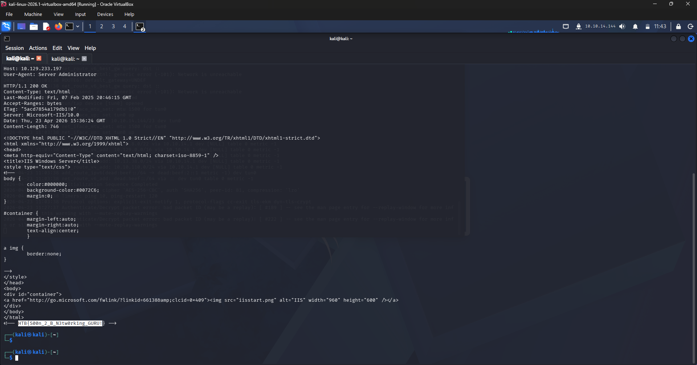
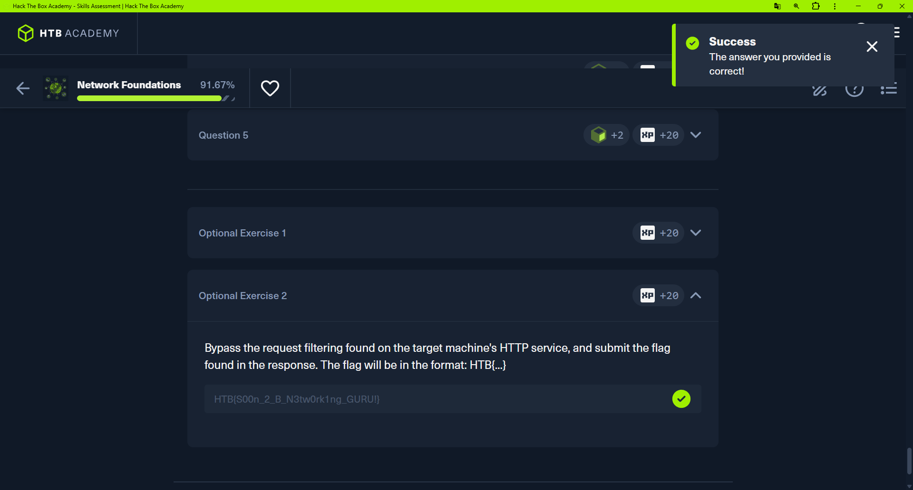
